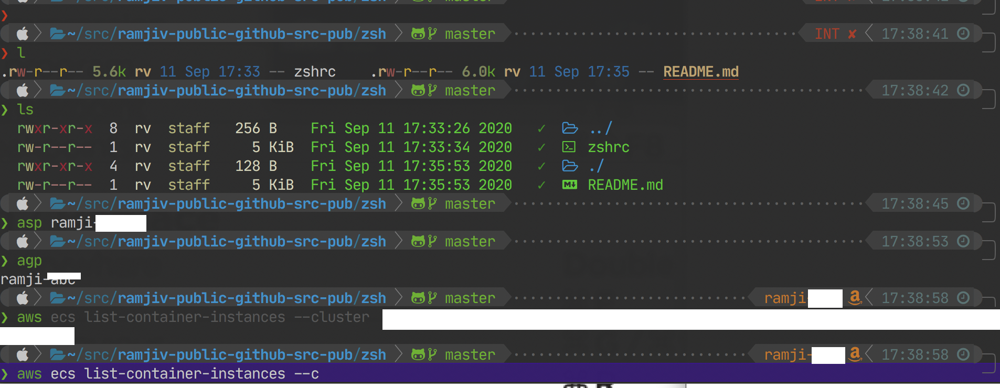

# ZSH configuration

Zsh has some rather extreme and beautiful configuration options. This is by far no means a complete explanation or even a correct one - however there is a pretty decent zsh environment currently under my fingertips.



In general, I have run the brew-install documented elsewhere in this repo beforehand.


## .zshrc

Ideally this will become a blow by blow narrative of how things work for future reference, right now it's pretty raw.

```zsh


# {TODO} Reorganize per schema below
#if it is needed by a command run non-interactively: .zshenv
#if it should be updated on each new shell: .zshenv
#if it runs a command which may take some time to complete: .zprofile
#if it is related to interactive usage: .zshrc
#if it is a command to be run when the shell is fully setup: .zlogin
#if it releases a resource acquired at login: .zlogout

# Create a cache folder if it doesn't exists
export ZSH_CACHE_DIR=$HOME/.cache/zsh
if [ ! -d "$ZSH_CACHE_DIR" ]; then
    mkdir -p $ZSH_CACHE_DIR
fi

# Use the  cache file for our compiled dump
export ZSH_COMPDUMP="$ZSH_CACHE_DIR/zcompdump-$HOST-$ZSH_VERSION"


# If you come from bash you might have to change your $PATH.
export PATH=/bin:/sbin:/usr/bin:/usr/sbin:/usr/local/bin:/usr/local/sbin
export PATH=$PATH:$HOME/bin:$HOME/.local/bin:$HOME/src/config/bin
# Add PGSQL to the path
export PATH="/usr/local/opt/postgresql@11/bin:$PATH"
# this should probably move to .zshenv

#
# Starships are meant to fly!
eval "$(starship init zsh)"


# If $HOME/.antigen exists then source antigen.zsh otherwise download new.
[[ ! -d "$HOME/.antigen" ]] && git clone https://github.com/zsh-users/antigen.git "$HOME/.antigen"
source "$HOME/.antigen/antigen.zsh"

# using oh-my-zsh means no need to preface for the plugins that are part of it.

antigen use oh-my-zsh


# General Quality of Life
# Not sure what these do yet, WIP!
antigen bundle command-not-found
antigen bundle lein
antigen bundle tmux
antigen bundle zpm-zsh/clipboard
antigen bundle zsh-users/zaw
antigen bundle MichaelAquilina/zsh-you-should-use
antigen bundle joow/youtube-dl

## FZF - fast searching for zsh
antigen bundle fzf
antigen bundle Aloxaf/fzf-tab
antigen bundle leophys/zsh-plugin-fzf-finder

# handle directory changes better
## antigen bundle dbkaplun/smart-cd ##
antigen bundle direnv
antigen bundle virtualenv
antigen bundle Tarrasch/zsh-autoenv
antigen bundle zpm-zsh/ls
antigen bundle Kallahan23/zsh-colorls
antigen bundle gretzky/auto-color-ls

# Handle VCS better
antigen bundle git
antigen bundle git-extras
antigen bundle git-flow
antigen bundle git-prompt
antigen bundle peterhurford/git-aliases.zsh
antigen bundle robertzk/send.zsh
antigen bundle romkatv/gitstatus

# Handle programming better
antigen bundle golang
antigen bundle node
antigen bundle npm
antigen bundle perl
antigen bundle python

# ZSH autocompletion & Syntax Highlighting
antigen bundle zdharma/fast-syntax-highlighting
antigen bundle zsh-users/zsh-autosuggestions
antigen bundle zsh-users/zsh-completions
antigen bundle zsh-users/zsh-history-substring-search ./zsh-history-substring-search.zsh
antigen bundle zsh-users/zsh-syntax-highlighting

# Docker & Container
antigen bundle docker
antigen bundle zsh-users/zsh-docker

# AWS related
antigen bundle blimmer/zsh-aws-vault
antigen bundle aws
antigen bundle macunha1/zsh-terraform

# JQ/JSON tools
antigen bundle jsontools
antigen bundle reegnz/jq-zsh-plugin


# Themes
antigen theme romkatv/powerlevel10k
#

# OSX SPECIFIC >>>>>

if [[ "$OSTYPE" == "darwin"* ]]; then
  #echo "Detected OSX environment"
  antigen bundle brew
  antigen bundle osx
  antigen bundle zsh-users/zsh-apple-touchbar
  antigen bundle unixorn/tumult.plugin.zsh
  # Jetbrains Toolchain
  antigen bundle marcossegovia/open-create-projects
  antigen bundle davidtong/vsc.plugin.zsh

fi

# <<< END OF OSX SPECIFIC

## >>>> DO NOT REMOVE THE LINE BELOW (antigen apply)
antigen apply
### <<<<

# [TODO] Do I really need to source this ?
source /usr/local/share/zsh-autosuggestions/zsh-autosuggestions.zsh

## Antigen has now loaded all the goodies; let's make things pretty!
export ZSH_THEME="powerlevel10k/powerlevel10k"
if [[ -r "${XDG_CACHE_HOME:-$HOME/.cache}/p10k-instant-prompt-${(%):-%n}.zsh" ]]; then
  source "${XDG_CACHE_HOME:-$HOME/.cache}/p10k-instant-prompt-${(%):-%n}.zsh"
fi
# To customize prompt, run `p10k configure` or edit ~/.p10k.zsh.
[[ ! -f ~/.p10k.zsh ]] || source ~/.p10k.zsh


# Load fzf. This will usually be installed when neovim plugins are installed.
if [[ -f ~/.fzf.zsh ]] source ~/.fzf.zsh


# use fzf for everything
zstyle ':completion:*' fzf-search-display true


# Put the line below in ~/.zshrc:
#
#   eval "$(jump shell zsh)"
#
# The following lines are autogenerated:
#
__jump_chpwd() {
  jump chdir
}

jump_completion() {
  reply=(${(f)"$(jump hint $@)"})
}

j() {
  local dir="$(jump cd $@)"
  test -d "$dir" && cd "$dir"
}

typeset -gaU chpwd_functions
chpwd_functions+=__jump_chpwd

compctl -U -K jump_completion j


if (( $+commands[pyenv] )); then
  eval "$(pyenv init -)"
fi

if (( $+commands[pyenv-virtualenv-init] )); then
  eval "$(pyenv virtualenv-init -)"
fi

if (( $+commands[rbenv] )); then
  eval "$(rbenv init -)"
fi

export ZSH_CACHE_DIR=$HOME/.cache/zsh

# override a couple of functions because it's a headache otherwise.
# [TODO]: FIX THESE AND GET RID OF THE PACKAGES
alias ls='\colorls -lart --git'
alias l='exa -G -lar --git'

reload_zsh() {
	local cache="$ZSH_CACHE_DIR"
	autoload -U compinit zrecompile
	compinit -i -d "$cache/zcomp-$HOST"

	for f in ${ZDOTDIR:-~}/.zshrc "$cache/zcomp-$HOST"; do
		zrecompile -p $f && command rm -f $f.zwc.old
	done

	# Use $SHELL if it's available and a zsh shell
	local shell="$ZSH_ARGZERO"
	if [[ "${${SHELL:t}#-}" = zsh ]]; then
		shell="$SHELL"
	fi

	# Remove leading dash if login shell and run accordingly
	if [[ "${shell:0:1}" = "-" ]]; then
		exec -l "${shell#-}"
	else
		exec "$shell"
	fi
}


# Make it possible to add per-machine customizations.
if [[ -f ~/.zshrc.local ]] source ~/.zshrc.local

```
